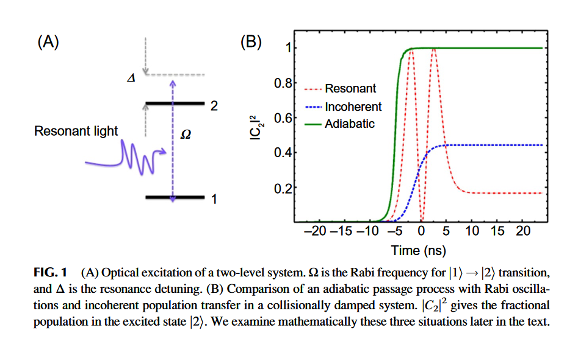

---
presentation:
  theme: serif.css
  mouseWheel: true
  width: 1920
  height: 1080
---

<!-- slide -->
# 斯塔克诱导绝热通道过程选择性地制备振动激发单态和量子态叠加
<!-- slide -->
## 引言

> To perform a fully quantum mechanical study if inelastic and collisions in a laboratory setting need to prepare a large population of target molecules in a single vibrational ($\kappa$), rotational ($J$), and magetic ($M$) quantum state.
<!-- slide -->

### How Can a Large Ensemble of Molecular Targets be Prepared in a Selected Highly Vibrationally Excited Quantum State With Rotational ($J$, $M$) Quantum Number Precision?

> To obasrve single colliision0-free ambience of a dilute molecular gas or in molecular beam.

Optival methods:

- Raman scattering
- Franck-Condon pumping
- emission pumping
- chirped pulse infrared ladder excitation

**Raman adiabatic pumping**

<!-- slide -->

> Fig. 1 describes three typical situations where the ground and excited states are optically coupled by single or multiphoton resonance interaction represented by the coupling strength Ω.

- Resonant: the familiar Rabi oscillations
- Incoherent: the presence of collisional damping
- Adiabatic: an adiabatic passage process

> Rabi oscillations in a consistent manner need to precisely control the frequency and energy of the pulse

<!-- slide -->

<!-- slide -->

$$H_{int} = - \vec{\mu} \cdot \vec{E} (t) $$

$$|\Psi (t)\rangle = c_1 (t) |1\rangle + c_2 (t) |2\rangle + \sum_{k \neq 1,2 } c_k (t)|k\rangle$$

$$ i \hbar \frac{\mathrm{d} |\Psi (t) \rangle }{\mathrm{d}t}= (H_0 + H_{int} )|\Psi (t) \rangle  $$

$$ \frac{\mathrm{d} c_1}{\mathrm{d}t} = - \frac{\vec{\mu}_{1k} \cdot \vec{E}}{\hbar} \exp \left[i \omega_{1k} t \right]$$
$$ \frac{\mathrm{d} c_2}{\mathrm{d}t} = - \frac{\vec{\mu}_{2k} \cdot \vec{E}}{\hbar} \exp \left[i \omega_{2k} t \right]$$

$$ \left(\frac{\mathrm{d} c_k}{\mathrm{d}t}\right)_{k\neq 1,2} = - \frac{\vec{\mu}_{k1} \cdot \vec{E}}{\hbar} \exp \left[i \omega_{k1t } t \right] c_1  - \frac{\vec{\mu}_{k2} \cdot \vec{E}}{\hbar} \exp \left[i \omega_{k2 } t \right] c_2  $$
<!-- slide -->
$$ \frac{\mathrm{d}}{\mathrm{d} t }\left( \begin{matrix} c_1 \\ c_2\end{matrix}\right)= - i \left[ \begin{matrix} \Delta_{11}& \Omega_{12} \\
\Omega_{21} & \Delta_{22} \end{matrix} \right] \left( \begin{matrix} c_1 \\ c_2\end{matrix}\right)  $$

$$ \Delta_{ii} = - \left[\alpha_i (\omega_P)|E_P|^2  + \alpha_i (\omega_S) |E_S|^2  \right] / \hbar $$

$$ \Omega_{12} = {r_{12} \over  \hbar} E_P E^*_S  \exp \left[ i \delta_{12} t \right]$$

$$r_{12} = {1 \over \hbar }\sum_{k\neq 1,2} \mu_{1k} \mu_{k2} \left[ {1\over \omega_{k1} - \omega_P } + {1 \over \omega_{k1} + \omega_S}  \right]$$

<!-- slide -->
### Densty Matirx Equation

$$\rho =  \left[\begin{matrix} \rho_{11} & \rho_{12} \\ \rho_{21}  & \rho_{22} \end{matrix}\right] $$
$$ \rho_{11} = |c_1|^2,\quad \rho_{22} = |c_2|^2, \quad \mathrm{and} \quad \rho_{12} = c_1c_2^*  $$

$${\mathrm{d} \rho_{12} \over \mathrm{d} t } + i \Delta \rho_{12} = 2 i \Omega_{12} w $$

$$ { \mathrm{d} w \over \mathrm{d} t } = 2 \Im{\left[\Omega_{12}^* \rho_{12}\right]}$$

<!-- slide -->

### Stauration of Raman Pumping in a High-Pressure Gas Cell

$$ \rho_{12} = \left( {2 \Omega_{12} \over \Delta - i \gamma }\right) w $$

$$ w(t) = w(0) \exp\left[ - 4 \int_0^t \left( \Omega_{12}^2 / \gamma \right) \mathrm{d} t \right] $$

> $w(t=0) = -1/2 $ in the absence of Raman pumping.

### Bloch Vecrot Model for Stark-Induced Adiabatic Passage

$${\mathrm{d} \vec{R} \over \mathrm{d} t }= \vec{F}\times \vec{R}$$

> $\vec{R} = [Re(\rho_{12}), Im(\rho_{12}),w ]$, $\vec{F}= [2 \Omega_{12},0,-\Delta]$

