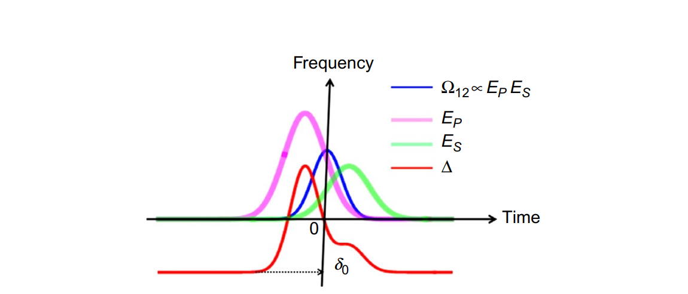

---
presentation:
  theme: serif.css
  mouseWheel: true
  width: 1920
  height: 1080
---

<!-- slide -->
# 斯塔克诱导绝热通道过程选择性地制备振动激发单态和量子态叠加
<!-- slide -->
## 引言

> To perform a fully quantum mechanical study if inelastic and collisions in a laboratory setting need to prepare a large population of target molecules in a single vibrational ($\kappa$), rotational ($J$), and magetic ($M$) quantum state.
<!-- slide -->

### How Can a Large Ensemble of Molecular Targets be Prepared in a Selected Highly Vibrationally Excited Quantum State With Rotational ($J$, $M$) Quantum Number Precision?

> To obasrve single colliision0-free ambience of a dilute molecular gas or in molecular beam.

Optival methods:

- Raman scattering
- Franck-Condon pumping
- emission pumping
- chirped pulse infrared ladder excitation

### Raman adiabatic pumping

<!-- slide -->

> Fig. 1 describes three typical situations where the ground and excited states are optically coupled by single or multiphoton resonance interaction represented by the coupling strength $\Omega$.

- Resonant: the familiar Rabi oscillations
- Incoherent: the presence of collisional damping
- Adiabatic: an adiabatic passage process

> Rabi oscillations in a consistent manner need to precisely control the frequency and energy of the pulse

<!-- slide -->

<!-- slide -->

$$H_{int} = - \vec{\mu} \cdot \vec{E} (t) $$

$$|\Psi (t)\rangle = c_1 (t) |1\rangle + c_2 (t) |2\rangle + \sum_{k \neq 1,2 } c_k (t)|k\rangle$$

$$ i \hbar \frac{\mathrm{d} |\Psi (t) \rangle }{\mathrm{d}t}= (H_0 + H_{int} )|\Psi (t) \rangle  $$

$$ \frac{\mathrm{d} c_1}{\mathrm{d}t} = - \frac{\vec{\mu}_{1k} \cdot \vec{E}}{\hbar} \exp \left[i \omega_{1k} t \right]$$
$$ \frac{\mathrm{d} c_2}{\mathrm{d}t} = - \frac{\vec{\mu}_{2k} \cdot \vec{E}}{\hbar} \exp \left[i \omega_{2k} t \right]$$

$$ \left(\frac{\mathrm{d} c_k}{\mathrm{d}t}\right)_{k\neq 1,2} = - \frac{\vec{\mu}_{k1} \cdot \vec{E}}{\hbar} \exp \left[i \omega_{k1t } t \right] c_1  - \frac{\vec{\mu}_{k2} \cdot \vec{E}}{\hbar} \exp \left[i \omega_{k2 } t \right] c_2  $$
<!-- slide -->
$$ \frac{\mathrm{d}}{\mathrm{d} t }\left( \begin{matrix} c_1 \\ c_2\end{matrix}\right)= - i \left[ \begin{matrix} \Delta_{11}& \Omega_{12} \\
\Omega_{21} & \Delta_{22} \end{matrix} \right] \left( \begin{matrix} c_1 \\ c_2\end{matrix}\right)  $$

$$ \Delta_{ii} = - \left[\alpha_i (\omega_P)|E_P|^2  + \alpha_i (\omega_S) |E_S|^2  \right] / \hbar $$

$$ \Omega_{12} = {r_{12} \over  \hbar} E_P E^*_S  \exp \left[ i \delta_{12} t \right]$$

$$r_{12} = {1 \over \hbar }\sum_{k\neq 1,2} \mu_{1k} \mu_{k2} \left[ {1\over \omega_{k1} - \omega_P } + {1 \over \omega_{k1} + \omega_S}  \right]$$

<!-- slide -->
### Densty Matirx Equation

$$\rho =  \left[\begin{matrix} \rho_{11} & \rho_{12} \\ \rho_{21}  & \rho_{22} \end{matrix}\right] $$
$$ \rho_{11} = |c_1|^2,\quad \rho_{22} = |c_2|^2, \quad \mathrm{and} \quad \rho_{12} = c_1c_2^*  $$

$${\mathrm{d} \rho_{12} \over \mathrm{d} t } + i \Delta \rho_{12} = 2 i \Omega_{12} w $$

$$ { \mathrm{d} w \over \mathrm{d} t } = 2 \Im{\left[\Omega_{12}^* \rho_{12}\right]}$$

<!-- slide -->

### Stauration of Raman Pumping in a High-Pressure Gas Cell

$$ \rho_{12} = \left( {2 \Omega_{12} \over \Delta - i \gamma }\right) w $$

$$ w(t) = w(0) \exp\left[ - 4 \int_0^t \left( \Omega_{12}^2 / \gamma \right) \mathrm{d} t \right] $$

> $w(t=0) = -1/2 $ in the absence of Raman pumping.

### Bloch Vecrot Model for Stark-Induced Adiabatic Passage

$${\mathrm{d} \vec{R} \over \mathrm{d} t }= \vec{F}\times \vec{R}$$

> $\vec{R} = [\mathrm{Re}(\rho_{12}), \mathrm{Im}(\rho_{12}),w]$, $\vec{F}= [2 \Omega_{12},0,-\Delta]$

<!-- slide -->

> Bloch-Feynman vector model for the Stark-induced adiabatic passage process. The Bloch vector $\vec{R}$ represents the molecular state, while the field vector $\vec{F}$ refers to the combined optical field of the pump and Stokes pulses that drive the Raman transition. In the pseudo space, the Z-component of the Bloch vector $\vec{R}$ refers to population inversion between the initial and final vibrational levels. Note that as the Raman detuning $\Delta$ changes due to the light-induced Stark shift, the $Z$-component of $\vec{F}$ passes through the X-Y plane of the pseudo space and reverses the sign. If $\vec{R}$ spins around $\vec{F}$ fast enough and $\vec{F}$ changes slowly enough, $\vec{R}$ will be able to follow $\vec{F}$, eventually also inverting along $Z$. Inversion of $R$ along $Z$ corresponds to inversion of population between the initial and final vibrational levels. This is adiabatic population inversion.
<!-- slide -->
$${\mathrm{d} |\vec{F}|\over \mathrm{d}t} {1 \over |\vec{F}|}< |\vec{F}|\tag{19}$$
$$ {\mathrm{d} \Delta \over \mathrm{d}t} < 2 \pi \Omega_{12}^2 \tag{20}$$
<!-- slide -->
### Rabi Oscillatins

$$ \mathrm{Im} (\rho_{12} ) = - {1\over 2} \sin{\Omega_{12} t}\\w(t) = {1\over 2} \cos (\Omega_{12} t) \tag{21} $$

> Rabi Oscillations of population and Tanman cierence between te inintial and traget vibratinal levles as described by the rotatino of the Bloch vector $\vec{R}$ around a field vector $\vec{F}$ whose direciton remains constant(along the X-axis of the pseudo space). The rottation of Block vector $\vec{R}$ takes place in Y-Z plane of thhe pseudo space.
<!-- slide -->
### Coherent Population Return is a Problem for Stark-Induced Population Transfer

$$\Delta \approx \delta_0 - \Delta_{AC} \tag{22}$$

$$ \Delta _{AC} = {(\alpha_2 - \alpha_1)\over \hbar}\left[ |E_P|^2 +|E_S|^2\right] \tag{23}$$

> (A) Time dependence of the resonance detuning $\Delta (t)$ (solid) as the light-induced Stark shift changes with the pulse intensity $I(t)$ (dashed). With an initial detuning $\Delta (t=0)=\Delta_0 $, the net detuning $\Delta (t)$ passes through zero, which corresponds to resonance, twice as the pulse intensity rises and falls. (B) The field vector F swings across the X-Y plane every time the net detuning goes through resonance, that is, $\Delta =0 $. If the Bloch vector R stays coupled to the field vector by strong Rabi frequency $\Omega$, then the Bloch vector also swings back and forth following the field vector. Swinging of
the Bloch vector across the X-Y plane represents population inversion. Thus, an even number of crossings results in zero population transfer. This is coherent population return.

<!-- slide -->
### How Do We Accomplish Stark-Induced Adiabatic Passage Using Pulsed Excitation?

> The dynamic detuning $\Delta$  (red) and Rabi frequency $\Omega$ (blue) in the presence of a delayed sequence of a strong pump pulse (purple) partially overlapping with a weaker Stokes pulse (green). The Rabi frequency $\Omega$ is strong only at one of the two zero-crossings of the detuning $\Delta$, thus ensuring
unidirectional flow of population from the initial to the target level.
