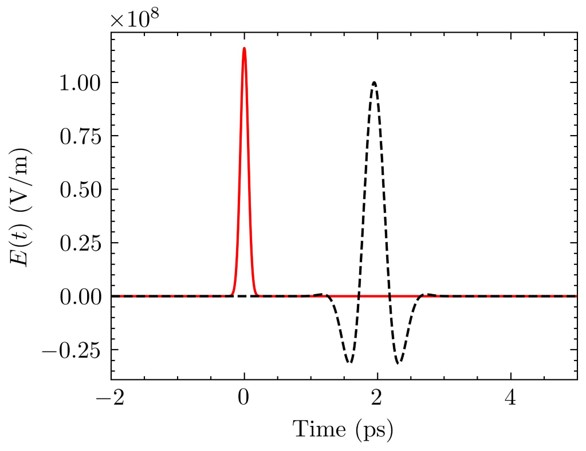
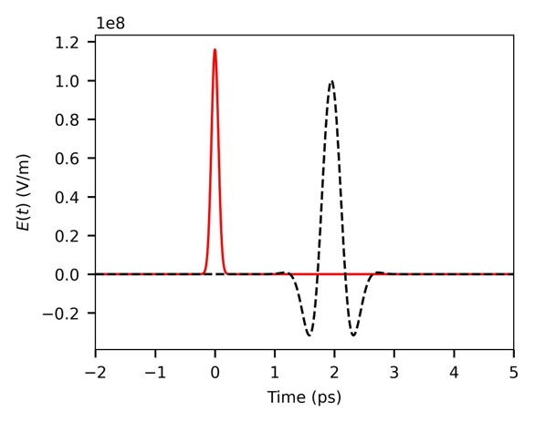
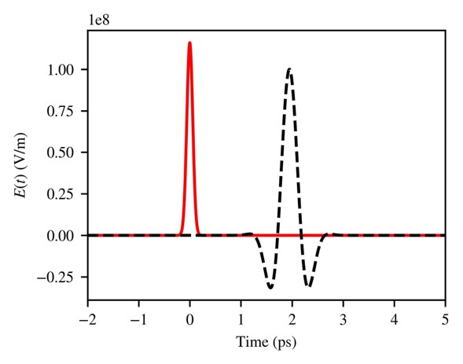
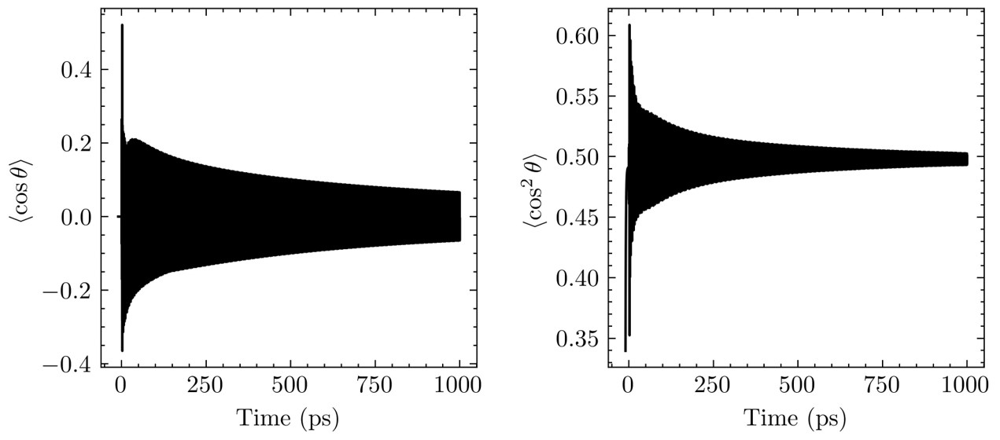
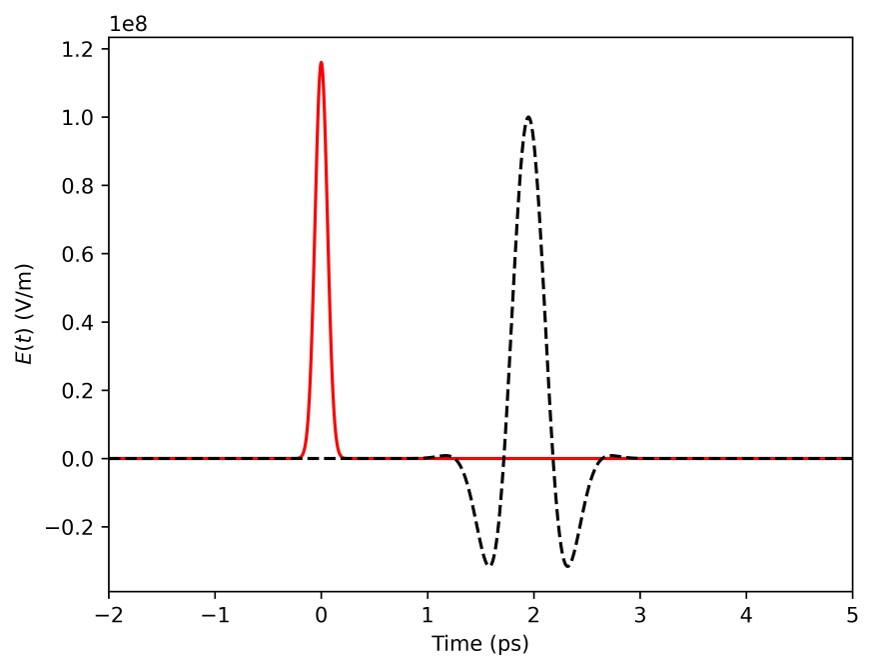
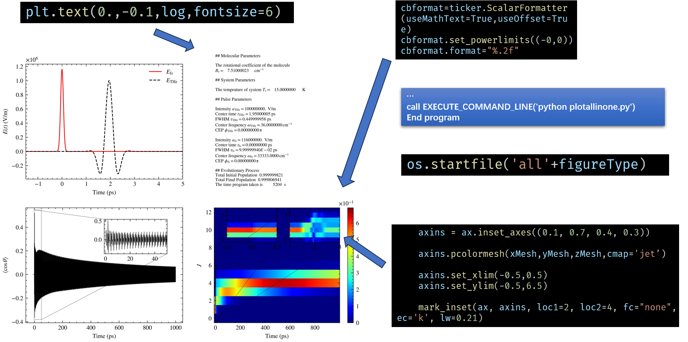

# 科研绘图

## 基本风格预设

### 使用`scienceplots`进行基础预设

安装

```shell
pip install scienceplots
```

调用

```python
import scienceplots
```

使用

```python
plt.style.use(['science','nature','ieee'])
```

#### `plt.style.use(['science'])`



#### `plt.style.use(['nature'])`



#### `plt.style.use(['ieee'])`



### 自定义风格预设

```python
plt.rcParams['ytick.right']  =plt.rcParams['xtick.top'] =True
xminorLocator=MultipleLocator(2)
plt.rcParams['set_minor_locator']=xminorLocator
plt.rcParams.update({
    "text.usetex": True,
    "font.family": "sans-serif",
    "font.sans-serif": ["Time New Rroman"]})
# for Palatino and other serif fonts use:
plt.rcParams.update({
    "text.usetex": True,
    "font.family": "serif",
    #"font.serif": ["Palatino"],
    "font.serif": ["Time New Roman"], 
})
# It's also possible to use the reduced notation by directly setting font.family:
plt.rcParams.update({
  "text.usetex": True,
  "font.family": "Time New Roman",
  "font.size": 8,
})

ax.set_box_aspect(0.618)
plt.rcParams['figure.figsize'] = (cm2inch(8), cm2inch(6.5))
#plt.rcParams['figure.figsize'] =(4,3)#(3.5,2.5)
plt.rcParams['lines.linewidth'] = 1
plt.rcParams['xtick.direction'] = 'in'
plt.rcParams['ytick.direction'] = 'in'
plt.rcParams['xtick.labelsize'] = 6
plt.rcParams['ytick.labelsize'] = 6
plt.rcParams['legend.fontsize'] = 6

from matplotlib import rcParams
config = {
    "text.usetex": False,
    "font.family":'serif',
    # "font.family":'stix',
    "font.size": 8,
    "mathtext.fontset":'stix',
    # "font.serif": ['SimSun'],
}
rcParams.update(config)
```

## 其他功能的实现

### 添加标签

#### 未添加标签



#### 添加 标签


```python
def setlabel(ax, label, loc=2, borderpad=0.6, **kwargs):
    legend = ax.get_legend()
    if legend:
        ax.add_artist(legend)
    line, = ax.plot(numpy.NaN,numpy.NaN,color='none',label=label,fillstyle='full')
    # legend_font = {
    # 'family': 'Times New Roman',
    # 'style':'normal',
    # 'size':10,
    # 'weight': "bold",
    # }
    label_legend = ax.legend(handles=[line],
                             loc=[-0.2,1.0005],
                             handlelength=0.0,
                             handleheight=0.0,
                             handletextpad=0.0,
                             borderaxespad=0.0,
                             borderpad=borderpad,
                             frameon=False,
                             shadow=True,
                             facecolor='gray',
                             prop={'weight':'bold','size':8},
                             **kwargs)
    label_legend.remove()
    ax.add_artist(label_legend)
    line.remove()
```

### 科学计数法的使用

#### 未使用



#### 使用


```python
def sciforyax(ax):
    formatter=ticker.ScalarFormatter(useMathText=True)
    formatter.set_scientific(True)
    formatter.set_powerlimits((0,0))
    ax.yaxis.set_major_formatter(formatter)
def sciforxax(ax):
    formatter=ticker.ScalarFormatter(useMathText=True)
    formatter.set_scientific(True)
    formatter.set_powerlimits((0,0))
    ax.xaxis.set_major_formatter(formatter)
cbformat=ticker.ScalarFormatter(useMathText=True,useOffset=True)
cbformat.set_powerlimits((-0,0))
cbformat.format="%.2f"
```

### 预览操作



### 合成动图

```python
import  imageio
import os
def compose_gif(image_list,gif_name,myduration):
    frames=[]
    for image_name in image_list:
        frames.append(imageio.imread(image_name))
    imageio.mimsave(gif_name,frames,'GIF',duration=myduration)
    return
```
